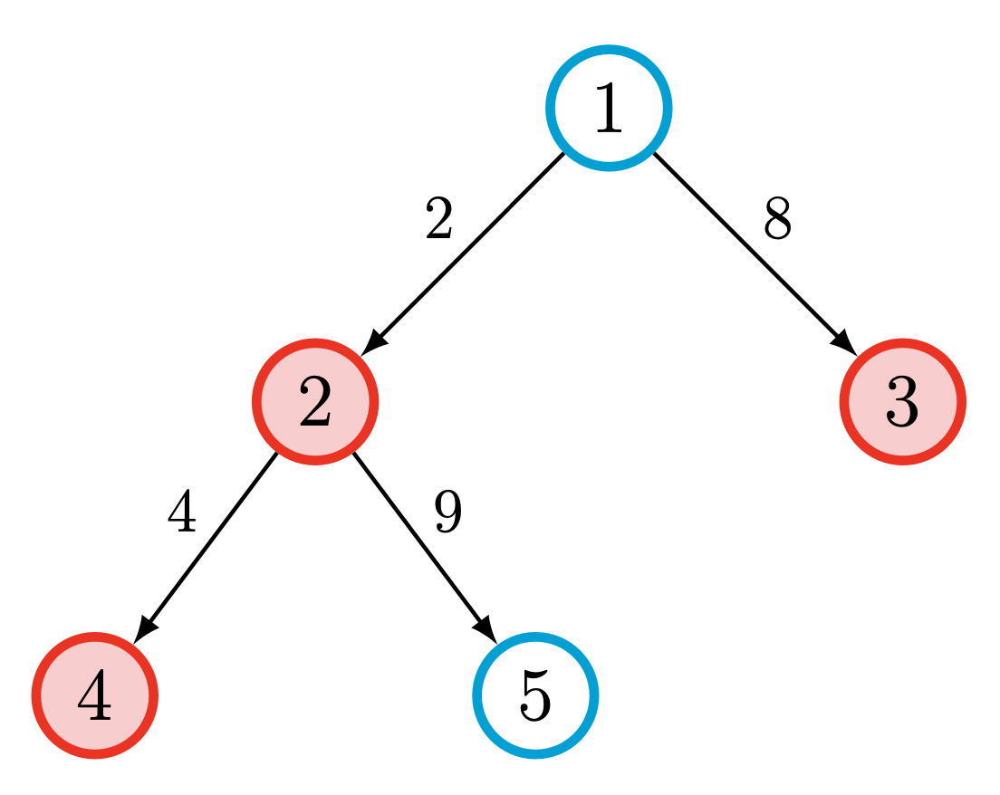

# VI. Treejumper

---

**Skiwi** loves trees, so you decide to gift him a computer science tree rooted at 1. To make things exciting, you hide money in some of the nodes. Skiwi wants to collect all the money as quickly as possible—he’s on a deadline with an essay to write. Each edge takes him $\mathbf{w_i}$ seconds to traverse, and he **starts at the root node (1)**. What is the minimum amount of time Skiwi needs to collect all the money? 

**Note: Skiwi does not need to return to the root.**

### Input
The first line contains $t \\; (1 \leqslant t \leqslant 100)$, the number of test cases.

Then, $t$ test cases follow, and for each test case:

- The first line contains one integer $n \\, (1 \leqslant n \leqslant 5 \cdot 10^5)$, the number of nodes in the tree.
- Then, $n-1$ lines follow, each containing three integers that are space-separated, $u,v \\, (1 \leqslant u,v \leqslant n)$ and $w_i \\, (1 \leqslant w_i \leqslant 10^9)$, denoting an edge of weight $w_i$ between nodes $u$ and $v$.
- Then, a line containing $k \\, (0 \leqslant k \leqslant n)$, the number of nodes with money stashed in them.
- Then, a line containing $k$ space-separated integers, denoting the nodes with money in it.

### Output
For each test case, output a single line containing one integer for each test case, representing the minimum time in seconds for Skiwi to grab all the money.

### Example Input
```
2
5
1 2 2
2 4 4
1 3 8
2 5 9
3
2 3 4
10
2 3 3
1 7 27
1 8 20
1 5 30
3 6 8
3 9 26
2 10 3
1 2 18
1 4 22
5
9 5 4 2 10
```

### Example Output
```
20
157
```

### Note
 

This is test case 1 visualised, with money nodes in red. The optimal pathing is as follows: 

$1 \to 2 \to 4 \to 2 \to 1 \to 8$. The total cost of this pathing is $2 + 4 + 4 + 2 + 8 = 20$.


### Skiwi
Here's a picture of a Skiwi


